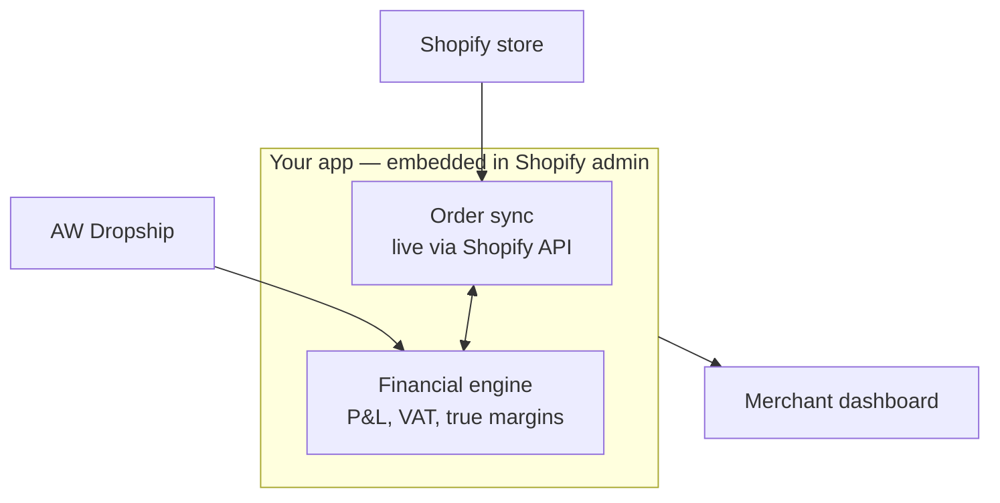

# AW Dropshipper Ledger — Project Plan

*Living document — last updated 25 July 2026. Update this as decisions get made or reversed; don't let it go stale.*

## 1. The idea

Turn the existing Tatsatiti Ledger (a single-company, browser-based bookkeeping tool built for one Shopify + AW Dropship business) into a standalone multi-tenant Shopify app for **AW Dropship sellers specifically** — reconciling Shopify sales against AW supplier costs to show true margin, P&L, and VAT position.

**Long-term ambition:** get this in front of AW (Ancient Wisdom Marketing Ltd) as a potential official/recommended integration. **Near-term plan:** build and prove it independently first — see Section 2.

## 2. Strategy

- **Don't pitch AW cold with a finished build.** AW already run their own Shopify app ("AW Connect") handling order processing and warehouse fulfillment (UK, Slovakia, Spain) — no bookkeeping/margin/VAT feature exists there, so this is genuine white space, not a duplicate. But AW built their whole dropship platform and APIs in-house, meaning they have the engineering capacity to clone a good idea once they've seen it fully working.
- **Sequence:** build independently → get real merchants using it (distribution via the existing AW dropshipping seller community — Facebook groups, forums — not through AW) → gather traction/testimonials → *then* approach AW from a position of leverage.
- **Realistic outcomes with AW**, roughly in order of likelihood: (1) API access to invoice/order data instead of PDF-scraping, (2) a referral/recommendation relationship or app-store listing, (3) a revenue-share partnership, (4) full acquisition — only plausible once traction makes buying cheaper than building.
- **Branding:** no "AW" in the app name or marketing, no implied affiliation, until there's an actual agreement. Position as "built for AW Dropship sellers."
- **Data sensitivity:** this becomes real financial data (VAT, invoices, margins) for other people's businesses once multi-tenant — security/data-handling bar is much higher than the original personal browser-storage tool.

## 3. What we're keeping from the original build vs. rebuilding

| Piece | Verdict | Why |
|---|---|---|
| P&L / VAT / margin calculation functions | Keep, near-verbatim | Pure functions over order/invoice arrays — framework-agnostic |
| Date/range helpers (`monthKey`, `fmtGBP`, FY logic, etc.) | Keep | Same reason |
| AW invoice parser (`parseSupplierInvoiceText`) + pdf.js extraction | Keep, runs client-side | Extract text from uploaded PDF in-browser, POST parsed JSON to server. No server-side PDF library needed. Only ingestion path for now — harden with more sample invoices over time |
| Dashboard / P&L / VAT / Sales / Purchases screen concepts | Keep as reference | Rebuild markup in Polaris, but layout/content carries over |
| CSV order import (Papaparse) | Cut | Replaced by live Shopify order sync |
| `window.storage` persistence | Cut | Replaced by Postgres, multi-tenant |
| Hardcoded company (Tatsatiti, UTR, Companies House dates) | Rebuild as per-shop settings | Generalize to any merchant |
| Customer Intelligence / Business Intelligence / Companies House tabs | Cut for v1 | Deferred to Stage 2 (Companies House concept likely dropped entirely — see Section 5) |

## 4. Stage 1 — MVP

### Stack
- Shopify CLI Remix app template (`shopify app init`) — OAuth, session storage, webhooks, App Bridge out of the box
- Polaris for UI
- Prisma + Postgres (Railway managed Postgres, swapped in for the template's default SQLite)
- GitHub repo → Railway auto-deploy on push to `main`

### Core loop (v1) — protect this, don't dilute it
**In:**
- Shopify OAuth install
- Live order sync via webhooks (`orders/create`, `orders/updated`, `orders/cancelled`, `refunds/create`) + one-time historical backfill on install
- AW invoice upload (PDF or paste-text, parsed client-side)
- Dashboard: revenue, AW cost, true margin, order count
- P&L view
- VAT view (output tax from sales, input tax from AW invoices, net position) — UK-specific for v1
- Minimal settings: company name, VAT registration toggle/number

**Out for v1 (deferred to Stage 2):** customer intelligence, product/BI trends, Companies House reminders, multi-supplier support, multi-currency, billing/subscription (run beta free)

### Data model (sketch)
```
shops(id, shopify_domain, access_token, installed_at, company_name, vat_number)
orders(id, shop_id, shopify_order_id, name, status, paid_at, subtotal, shipping, taxes, total, currency)
order_line_items(id, order_id, sku, name, qty, price, vendor)
supplier_invoices(id, shop_id, doc_number, type, date, total_net, vat, total, payment_state)
supplier_invoice_line_items(id, invoice_id, code, desc, price, qty, amount)
```
*(Stage 2 note: add a warehouse/origin-country field to `orders` and `supplier_invoices` ahead of EU work — see Section 5.)*

### Target architecture



### Build order
- [ ] Scaffold via Shopify CLI, push to GitHub, connect Railway, confirm OAuth install works end-to-end on a Partner dev store
- [ ] Swap SQLite → Railway Postgres, define Prisma schema
- [ ] Apply for `read_all_orders` scope approval (standard `read_orders` only covers 60 days of history — apply early, it's a form-fill delay not engineering work)
- [ ] Wire up order webhooks + historical backfill
- [ ] Port over calculation functions and invoice parser verbatim
- [ ] Build Polaris screens: Dashboard, P&L, VAT, Sales, Purchases, Settings
- [ ] Test against Tatsatiti's real historical data (existing QA dataset)
- [ ] Recruit 2–3 beta merchants from the AW dropshipping community, iterate

## 5. Stage 2 — documented, not built yet

### 5a. EU expansion
The hard part is VAT, and it hinges on **which AW warehouse fulfills the order** (UK vs. Slovakia vs. Spain — different regimes post-Brexit).

Key mechanics (current as of 2026):
- Single EU-wide €10,000/year threshold for cross-border B2C distance sales. Below it, charge home-country VAT; above it, charge destination-country VAT (via OSS or local registrations).
- The €10,000 threshold **doesn't apply at all if stock is held in another EU country** — storage abroad (e.g. a merchant's stock sitting in AW's Slovakia or Spain warehouse) can trigger a local VAT registration obligation regardless of sales volume. This is the one that bites AW sellers specifically.
- IOSS can simplify import VAT for UK-origin parcels into the EU under €150; above that, standard customs/import VAT applies.

**Data model action item:** capture fulfilling warehouse/origin country as a first-class field on every order and invoice now, before any EU VAT logic exists.

Proposed split:
| Sub-stage | Scope | Notes |
|---|---|---|
| 2a — foundation | Multi-currency (EUR), shop-level home-country setting, generalized invoice parser for AW's Slovakia/Spain invoice formats, basic single-country VAT | Immediately useful to an EU merchant selling mostly domestically. Need real EU invoice samples before the parser is buildable — currently unknown/unconfirmed format |
| 2b — cross-border VAT | OSS-aware calculation, warehouse-triggered registration flags, IOSS handling | Get a tax professional to review the logic before shipping — real financial/legal consequences for merchants if wrong |

Data residency: Railway supports EU deployment regions if needed.

### 5b. Enhanced Customer & Business Intelligence
Upgrades to the existing Customer/BI tab concepts, not replacements:

- **Customer intel:** repeat/one-time split → real cohort retention + LTV curves; RFM segmentation; acquisition-channel breakdown from Shopify `Source`/UTM data
- **Business intel:** current margin snapshot → SKU-level margin *trend over time* (surfaces AW price creep between invoices); revenue-concentration risk (% from top N SKUs); basket/cross-sell analysis
- **New capability, multi-tenant only:** anonymized cross-merchant benchmarking — "your margin on candles is X%, network average is Y%." Worth keeping as a card to play in the eventual AW conversation, since aggregated performance data across their own catalog is something even AW likely doesn't have visibility into internally.

## 6. Open questions / decisions needed
- [ ] App name (neutral, no "AW" branding)
- [ ] Confirm Shopify Partner account + create the app in Partner dashboard
- [ ] Get real AW Slovakia/Spain invoice samples before scoping 2a in earnest
- [ ] Identify 2–3 candidate beta merchants from the AW seller community
- [ ] Decide beta pricing (likely free) vs. when to introduce Shopify Billing

## 7. Changelog
- **25 Jul 2026** — Initial plan drafted: strategy, Stage 1 MVP scope, Stage 2 roadmap (EU expansion, enhanced BI/CI)
